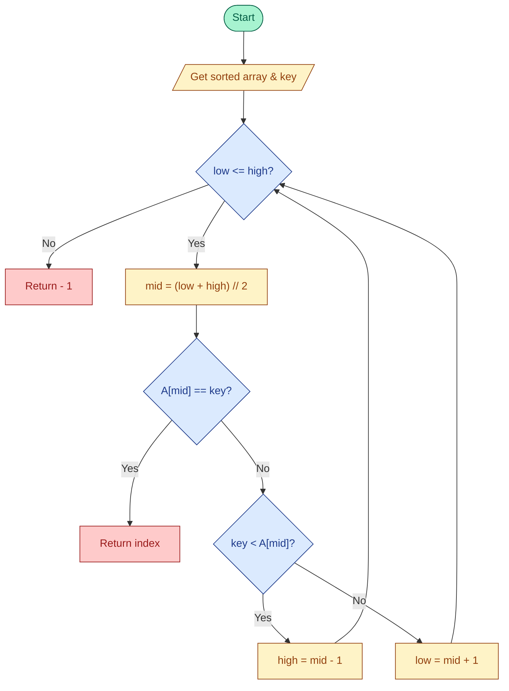

# Binary Search

## Link
https://www.geeksforgeeks.org/dsa/binary-search/

## Condition
- Sorted array (ascending)

## Algorithm (step-by-step)
1. Initialize low = 0, high = n - 1
2. While low <= high:
   - mid = floor((low + high) / 2)
   - If A[mid] == key: return mid (found)
   - Else if key < A[mid]: high = mid - 1
   - Else: low = mid + 1
3. If loop ends, return -1 (not found)

## Plantuml flow
  @startuml
' Optional styling
skinparam activityBackgroundColor #FEF3C7
skinparam activityBorderColor #92400E
skinparam activityDiamondBackgroundColor #DBEAFE
skinparam activityDiamondBorderColor #1E3A8A

start
:Initialize low = 0; high = n - 1;
while (low <= high?) is (yes)
  :mid = (low + high) // 2;
  if (A[mid] == key?) then (yes)
    :Return mid;
    stop
  else (no)
    if (key < A[mid]?) then (yes)
      :high = mid - 1;
    else (no)
      :low = mid + 1;
    endif
  endif
endwhile (no)
:Return -1;
stop
@enduml

## Binary Search (flowchart)



## The Binary Search Algorithm can be implemented in the following two ways

## Iterative Binary Search Algorithm
```c
#include <stdio.h>
int binarySearch(int arr[], int n, int x) {
    int low = 0;
    int high = n-1;
    while (low <= high) {
        int mid = low + (high - low) / 2;

        // Check if x is present at mid
        if (arr[mid] == x)
            return mid;

        // If x greater, ignore left half
        if (arr[mid] < x)
            low = mid + 1;

        // If x is smaller, ignore right half
        else
            high = mid - 1;
    }

    // If we reach here, then element was not present
    return -1;
}
```

## Recursive Binary Search Algorithm

```c
int binarySearch(int arr[], int low, int high, int x) {
    if (high >= low) {
        int mid = low + (high - low) / 2;

        // If the element is present at the middle
        // itself
        if (arr[mid] == x)
            return mid;

        // If element is smaller than mid, then
        // it can only be present in left subarray
        if (arr[mid] > x)
            return binarySearch(arr, low, mid - 1, x);

        // Else the element can only be present
        // in right subarray
        return binarySearch(arr, mid + 1, high, x);
    }

    // We reach here when element is not
    // present in array
    return -1;
}
```

## Binary Search Function in C++ STL 
- **binary_search()** : used to find an element in the container. It will only work on the sorted data
- **lower_bound()**   : used to find first element in the given range that is greater than or equal to 
                        the given value.
- **upper_bound()**   : used to find first element in the given range that is greater than the given 
                        value.

## Iterative vs Recursive Binary Search — Which is better? ✅

**Short answer:** For production use, **iterative** is usually better (faster, uses constant space). **Recursive** is useful for clarity/teaching and in languages where recursion is idiomatic. 💡

**Quick comparison** 🔧
- **Time complexity:** Both O(log n).
- **Space complexity:** Iterative — **O(1)** (constant); Recursive — **O(log n)** (call stack).
- **Performance:** Iterative is typically slightly faster (no function-call overhead).
- **Readability:** Recursive can be more concise and expressive; iterative is more explicit and straightforward.
- **Safety:** Iterative avoids recursion limits/stack overflow; recursion depth is ~log₂(n), which is usually small but can be limited in some runtimes. ⚠️

**When to choose**
- **Use iterative** for performance, memory predictability, and production code. ✅
- **Use recursive** for teaching, clarity, or when recursion is idiomatic. ✍️

**Recommendation:** Prefer the **iterative** implementation for production; use **recursive** when it improves clarity or for educational examples.